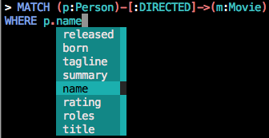

# cycli
A Command Line Interface for Neo4j's Cypher Query Language.


## Install

```
$ pip install cycli
```

## Usage

To start, simply execute `cycli` from your shell.

```
$ cycli
```

If you have Neo4j authentication enabled, you'll need to pass a username.

```
$ cycli -u username
```

You will then be prompted to enter your password. For more options, execute `cycli --help`.

## Features

### Autocomplete

The smart autocompletion suggests node labels when you're drawing a node, relationship types when you're drawing
a relationship, and properties when working with identifiers. Of course, it also suggests all of the Cypher keywords,
functions, and predicates.

#### Node Labels


#### Relationship Types


#### Properties



#### Cypher Keywords


### Syntax Highlighting

Catch syntax errors with the built-in syntax highlighting. The colors were chosen to emulate the syntax highlighting
available in the Neo4j browser.


## Execute Queries

Execute queries by ending them with a semicolon and pressing enter or by pressing enter twice.

## Keyboard Interrupts

Keyboard interrupts in `cycli` behave much like keyboard interrupts in the Python REPL. CTRL+C will clear your current
input and CTRL+D will exit the CLI if your current input is empty.

## Exiting

Exit `cycli` by typing "quit" or "exit" or by pressing CTRL+D on an empty line.